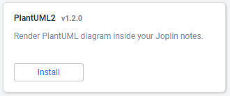

# Joplin Plugin - PlantUML2

This plugin allows you to create UML diagrams uing the syntax defined in [https://plantuml.com](https://plantuml.com).

## 1. Install the plugin

### Automatic installation

Use the Joplin plugin manager to install it (`Joplin > Options > Plugins`).
Search for `PlantUML2`.



### Manual installation

- Download the last release from this repository.
- Open `Joplin > Options > Plugins > Install from File`
- Select the jpl file you downloaded.

# 2. Markdown syntax

Use the markdown fence syntax to create a new PlantUML diagram.
Inside this block you can use the syntax documented at [https://plantuml.com](https://plantuml.com).

## Sequence Diagram Example

Syntax example:

    ```plantuml
    @startuml
    Alice -> Bob: Authentication Request
    Bob --> Alice: Authentication Response

    Alice -> Bob: Another authentication Request
    Alice <-- Bob: Another authentication Response
    @enduml
    ```

Rendering example:


## MindMap Diagram Example

Syntax example:

    ```plantuml
    @startmindmap
    * Debian
    ** Ubuntu
    *** Linux Mint
    *** Kubuntu
    *** Lubuntu
    *** KDE Neon
    ** LMDE
    ** SolydXK
    ** SteamOS
    ** Raspbian with a very long name
    *** <s>Raspmbc</s> => OSMC
    *** <s>Raspyfi</s> => Volumio
    @endmindmap
    ```

Rendering example:


# Other funcitonalities

## Context menu
Use the context menu on the rendered diagram to copy the image or the url.


## Menu shortcuts
If you don't remember the syntax to create a PlantUML diagram you can use the templates in the tools menu


## Options
Use the plugin's options to define the rendering server and the output format.


## Extra hints
- The tag name is case insensitive
- This plugin is not compatible with WYSIWYG editor

# Development
If you want to contribute to this plugin you can find here some userful references:

- [Joplin - Getting started with plugin development](https://joplinapp.org/api/get_started/plugins/)
- [Joplin - Plugin API reference](https://joplinapp.org/api/references/plugin_api/classes/joplin.html)
- [Joplin - Data API reference](https://joplinapp.org/api/references/rest_api/)
- [Joplin - Plugin examples](https://github.com/laurent22/joplin/tree/dev/packages/app-cli/tests/support/plugins)